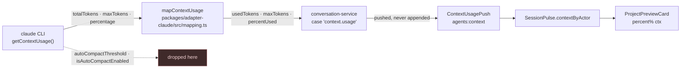
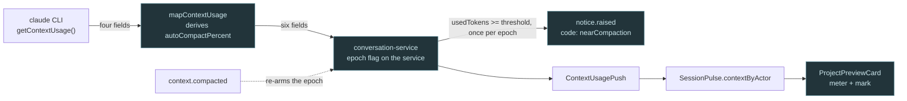
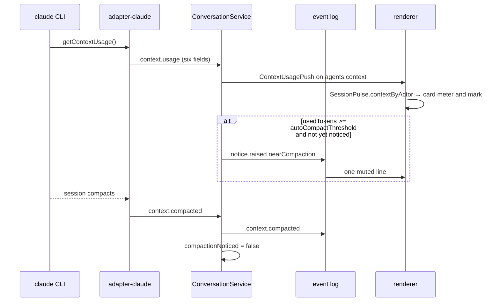

# The ceiling you can see

## Current / Issue

`context.usage` already measures how full the window is. What it does not carry is
the line the agent stops at: `mapContextUsage` reads `totalTokens` and `maxTokens`
and drops `autoCompactThreshold` and `isAutoCompactEnabled`, which the SDK's
`SDKControlGetContextUsageResponse` has been returning alongside them.

The card then prints `{{percent}}% ctx` with a tooltip promising "the agent
compacts when it fills" — a promise nothing on screen is drawn against, and one
the reader cannot check, because the single number that would check it never
leaves the adapter.



The measured shape of the response, read from the shipped CLI at
`~/.local/share/claude/versions/2.1.273`:

```ts
return { categories: $o.map(...), totalTokens: ms, maxTokens: Ke, rawMaxTokens: Ke,
  autocompactSource: Qe, percentage: Math.round(ms / Ke * 100), gridRows: Hs, ... }
```

Two facts follow, and both are load-bearing for the design below.

- **`maxTokens` and `rawMaxTokens` are the same value in this version.** The
  adapter's existing choice between them is therefore not a choice, and its
  `percentUsed` agrees with the CLI's own `percentage`.
- **`autoCompactThreshold` is the token count compaction fires at**, and it is
  the field C-010 describes. C-010's other half — that a bar drawn against
  `maxTokens` never fills — is stale for 2.1.273, where the denominator is the
  number the CLI itself divides by.

## Proposed

Carry the ceiling through to the card, and raise one durable line the first time
the fill reaches it.



The line is a `notice.raised` with a code, which is how every other durable
sentence in this transcript is worded — `staleEditPreview` and `contextCarried`
already go through `this.lifecycle`, and the renderer already turns a code into
words. Reusing it costs one key rather than a new event type and its five files.

The epoch matters: the fill resets on compaction, so a rule written against the
percent alone would raise the same line again every time the window climbed back
— a repeated notice about a thing the reader has already read. One flag on the
service, cleared by `context.compacted`, is the whole mechanism.

**Constraint.** Only the Claude adapter emits `context.usage`; codex does not, so
nothing here touches it. The card's figure is the maximum across a project's
conversations, and the mark inherits that reduction — it marks the fullest
conversation, not a named one.

## Code Changes

### `packages/agent-protocol/src/events.ts`

```ts
export interface ContextUsage extends AgentEventBase {
  readonly type: 'context.usage'
  readonly usedTokens: number
  readonly maxTokens: number
  /** 0-100, derived here so no reader has to guess the provider's units. */
  readonly percentUsed: number
  /** The token count compaction fires at, or null if the provider does not say. */
  readonly autoCompactThreshold: number | null
  /** 0-100, on the same axis as `percentUsed`. */
  readonly autoCompactPercent: number | null
  readonly autoCompactEnabled: boolean
}
```

### `packages/adapter-claude/src/mapping.ts`

```ts
export function mapContextUsage(usage: unknown, base: Omit<AgentEvent, 'type'>): AgentEvent[] {
  const info = usage as
    | {
        totalTokens?: unknown
        maxTokens?: unknown
        autoCompactThreshold?: unknown
        isAutoCompactEnabled?: unknown
      }
    | undefined
  const used = typeof info?.totalTokens === 'number' ? info.totalTokens : null
  const max = typeof info?.maxTokens === 'number' ? info.maxTokens : null
  if (used === null || max === null || max <= 0 || used < 0) return []

  const threshold =
    typeof info?.autoCompactThreshold === 'number' && info.autoCompactThreshold > 0
      ? info.autoCompactThreshold
      : null
  const clamp = (value: number): number => Math.min(100, Math.round(value))

  return [
    {
      ...base,
      type: 'context.usage',
      usedTokens: used,
      maxTokens: max,
      percentUsed: clamp((used / max) * 100),
      autoCompactThreshold: threshold,
      autoCompactPercent: threshold === null ? null : clamp((threshold / max) * 100),
      autoCompactEnabled: info?.isAutoCompactEnabled === true,
    },
  ]
}
```

### `packages/orchestrator/src/conversation-service.ts`

```ts
/** How full an agent's context window is, as last measured. */
export interface ContextWindow {
  readonly usedTokens: number
  readonly maxTokens: number
  /** 0-100. */
  readonly percentUsed: number
  readonly autoCompactThreshold: number | null
  readonly autoCompactPercent: number | null
  readonly autoCompactEnabled: boolean
}
```

```ts
  private compactionNoticed = false

  private reachedCeiling(event: ContextUsage): boolean {
    return (
      event.autoCompactEnabled &&
      event.autoCompactThreshold !== null &&
      event.usedTokens >= event.autoCompactThreshold
    )
  }
```

```ts
      case 'context.usage': {
        this.onContextUsage?.({
          usedTokens: event.usedTokens,
          maxTokens: event.maxTokens,
          percentUsed: event.percentUsed,
          autoCompactThreshold: event.autoCompactThreshold,
          autoCompactPercent: event.autoCompactPercent,
          autoCompactEnabled: event.autoCompactEnabled,
        })
        if (!this.compactionNoticed && this.reachedCeiling(event)) {
          this.compactionNoticed = true
          this.lifecycle({
            type: 'notice.raised',
            level: 'info',
            source: 'system',
            text: '',
            code: 'nearCompaction',
            detail: null,
          })
        }
        return
      }
```

```ts
      case 'context.compacted':
        this.compactionNoticed = false
        this.lifecycle({ type: 'context.compacted' })
        return
```

### `apps/desktop/src/shared/ipc.ts`

```ts
export const ContextUsagePush = z.object({
  conversationId: z.string(),
  agentId: AgentIdSchema,
  usedTokens: z.number().int(),
  maxTokens: z.number().int(),
  percentUsed: z.number(),
  autoCompactPercent: z.number().nullable(),
  autoCompactEnabled: z.boolean(),
})
```

### `apps/desktop/src/renderer/src/workspace/store.ts`

`contextByActor` keeps its name and changes what it holds. The name still
describes it, and the type is what makes every call site fail — a wrong name
would have compiled while meaning something else.

```ts
export interface ContextReading {
  readonly percent: number
  readonly markPercent: number | null
}
```

`autoCompactEnabled` stops at the adapter: a mark for a line that will never be
crossed is a lie, so `autoCompactPercent` is null whenever compaction is off, and
the renderer never has to ask.

```ts
  readonly contextByActor: Readonly<Record<string, ContextReading>>
```

```ts
      ingestContextUsage: (usage) => {
        set((state) => {
          const current = state.pulses[usage.conversationId]
          if (current === undefined) return state
          const previous = current.contextByActor[usage.agentId]
          if (
            previous?.percent === usage.percentUsed &&
            previous.markPercent === usage.autoCompactPercent
          ) {
            return state
          }
          return {
            pulses: {
              ...state.pulses,
              [usage.conversationId]: {
                ...current,
                contextByActor: {
                  ...current.contextByActor,
                  [usage.agentId]: {
                    percent: usage.percentUsed,
                    markPercent: usage.autoCompactPercent,
                    autoCompactEnabled: usage.autoCompactEnabled,
                  },
                },
              },
            },
          }
        })
      },
```

### `apps/desktop/src/renderer/src/workspace/hooks.ts`

```ts
export interface ProjectFacts {
  readonly tokens: number
  readonly costUsd: number | null
  readonly contextPercent: number | null
  readonly contextMarkPercent: number | null
  readonly tasks: ProjectFacts['tasks'][number][]
}
```

```ts
      for (const reading of Object.values(pulse.contextByActor)) {
        context = context === null ? reading.percent : Math.max(context, reading.percent)
        if (reading.markPercent === null) continue
        mark = mark === null ? reading.markPercent : Math.max(mark, reading.markPercent)
      }
```

```ts
    return JSON.stringify({
      tokens,
      costUsd: cost,
      contextPercent: context,
      contextMarkPercent: mark,
      tasks,
    })
```

### `apps/desktop/src/renderer/src/workspace/ProjectPreviewCard.tsx`

```tsx
        {facts.contextPercent !== null && (
          <>
            <dt>{t('preview.context')}</dt>
            <dd className="session-preview-figure">
              {t('context.short', { percent: facts.contextPercent })}
            </dd>
            <dd className="session-preview-meter">
              <i style={{ width: `${String(facts.contextPercent)}%` }} />
              {facts.contextMarkPercent !== null && (
                <i
                  className="session-preview-meter-mark"
                  style={{ left: `${String(facts.contextMarkPercent)}%` }}
                />
              )}
            </dd>
          </>
        )}
```

The meter also carries `context.title` as a `title`, and only when a mark is
drawn — the sentence explains the mark, so codex and a compaction that is off get
no tooltip rather than a sentence about something absent. The card is itself
`role="tooltip"`, so this is one tooltip on one element inside it, passed as
`title={cond ? undefined : …}` the way `ProjectSettings.tsx:78` does it.

### `apps/desktop/src/renderer/src/workspace/styles.css`

`.session-preview-meter` and `.session-preview-meter-mark` beside the other
`.session-preview-*` rules. Not `rail-meter`/`rail-meter-over`, although the
geometry is the same: those carry the plan window's elapsed and overspend
semantics, and a second meaning under one name is what the rail's own comment
argues against.

The mark's rule is qualified as `.session-preview-meter i.session-preview-meter-mark`,
for the reason `.rail-meter-over` records at `styles.css:8624`: the fill's rule is
one class and one element, so a bare mark class loses on specificity and draws in
the fill's own colour — the one thing it exists to differ from.

### `apps/desktop/src/renderer/src/i18n/en.json`

```json
  "context": {
    "short": "{{percent}}% ctx",
    "title": "Context window {{percent}}% full. The mark is where the agent compacts."
  },
```

```json
      "nearCompaction": "The context window is nearly full — the agent compacts at the mark. A new conversation starts clean."
```

### `BOARD.md`

C-010 is corrected rather than closed: its `autoCompactThreshold` observation is
right and now used, and its claim that a bar against `maxTokens` never fills does
not hold on 2.1.273, where `rawMaxTokens` equals `maxTokens` and the CLI's own
percentage divides by the same figure.

## Final Flow



## Not doing, and unverified

**Not doing.** No meter in the session row — the figure and its mark stay in the
project preview card, where the percent already is. No percent inside the notice
line: `notice.code.*` entries are fixed sentences today, and interpolating one
means changing how a coded notice is worded, which is a separate change.

**Unverified.** The numbers the DeepSeek path reports for `maxTokens` and
`autoCompactThreshold` — it runs with `CLAUDE_CODE_AUTO_COMPACT_WINDOW=786432`
against a 1M window, and nothing above establishes what the CLI answers there. The
reading that produced this plan was of the standard Claude path. Every conclusion
about field *semantics* rests on that binary; every conclusion about field
*values* is untested.
